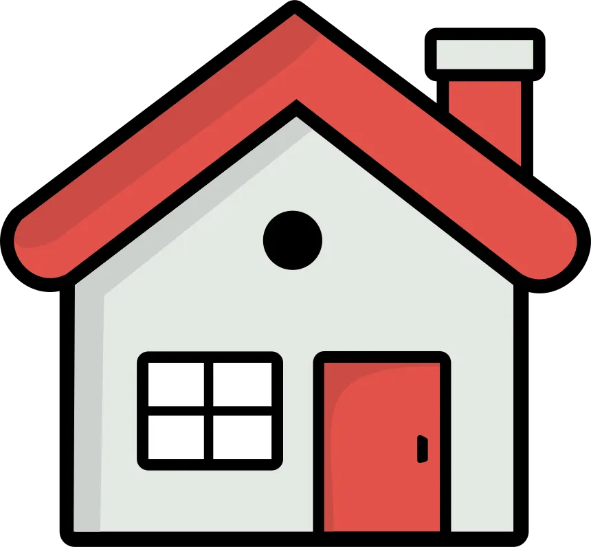

<!-- Improved compatibility of back to top link: See: https://github.com/othneildrew/Best-README-Template/pull/73 -->

<a id="readme-top"></a>

<!--
*** Thanks for checking out the Best-README-Template. If you have a suggestion
*** that would make this better, please fork the repo and create a pull request
*** or simply open an issue with the tag "enhancement".
*** Don't forget to give the project a star!
*** Thanks again! Now go create something AMAZING! :D
-->

<!-- PROJECT SHIELDS -->
<!--
*** I'm using markdown "reference style" links for readability.
*** Reference links are enclosed in brackets [ ] instead of parentheses ( ).
*** See the bottom of this document for the declaration of the reference variables
*** for contributors-url, forks-url, etc. This is an optional, concise syntax you may use.
*** https://www.markdownguide.org/basic-syntax/#reference-style-links
-->
<!-- [![Contributors][contributors-shield]][contributors-url]
[![Forks][forks-shield]][forks-url]
[![Stargazers][stars-shield]][stars-url]
[![Issues][issues-shield]][issues-url]
[![project_license][license-shield]][license-url]
[![LinkedIn][linkedin-shield]][linkedin-url] -->

<!-- PROJECT LOGO -->
<br />
<div align="center">
  <a href="https://github.com/abhic117/propertyChatbot">
    
  </a>

<h3 align="center">Startup-Searcher</h3>

  <p align="center">
     A RAG powered AI chatbot for property related queries
    <!-- <br />
    <a href="https://github.com/github_username/repo_name"><strong>Explore the docs »</strong></a>
    <br />
    <br />
    <a href="https://github.com/github_username/repo_name">View Demo</a>
    &middot;
    <a href="https://github.com/github_username/repo_name/issues/new?labels=bug&template=bug-report---.md">Report Bug</a>
    &middot;
    <a href="https://github.com/github_username/repo_name/issues/new?labels=enhancement&template=feature-request---.md">Request Feature</a> -->
  </p>
</div>

<!-- TABLE OF CONTENTS -->
<details>
  <summary>Table of Contents</summary>
  <ol>
    <li>
      <a href="#about-the-project">About The Project</a>
      <ul>
        <li><a href="#built-with">Built With</a></li>
      </ul>
    </li>
    <li>
      <a href="#getting-started">Getting Started</a>
      <ul>
        <li><a href="#installation">Installation</a></li>
        <li><a href="#running">Running</a></li>
      </ul>
    </li>
    <li><a href="#usage">Usage</a></li>
    <li><a href="#contact">Contact</a></li>
    <!-- <li><a href="#acknowledgments">Acknowledgments</a></li> -->
  </ol>
</details>

<!-- ABOUT THE PROJECT -->

## About The Project

[![Main UI][main-screenshot]](https://github.com/abhic117/propertyChatbot)

An AI powered chatbot that answers property related queries within the Blacktown area, such as "Whats the average house price in Blacktown?", and "Suggest a property in Schofields with a school nearby".

Powered by the Ollama Qwen2.5 model and integrated with a basic RAG pipeline, the chatbot is able to deliver accurate responses when compared to base LLMs.

<p align="right">(<a href="#readme-top">back to top</a>)</p>

### Built With

- [![Python][python.org]][python-url]
- [![Streamlit][streamlit.io]][streamlit-url]
- [![Ollama][ollama.com]][ollama-url]

<p align="right">(<a href="#readme-top">back to top</a>)</p>

<!-- GETTING STARTED -->

## Getting Started

To get a local copy up and running follow these simple steps.

### Installation

1. Clone the repo
   ```sh
   git clone https://github.com/abhic117/propertyChatbot.git
   ```
1. Create and activate virtual environment
   ```sh
   python -m venv venv
   ```
   ```
   venv\Scripts\activate.bat
   ```
   or
   ```
   venv\Scripts\activate.ps1
   ```
1. Install python packages
   ```sh
   python -m pip install -r requirements.txt
   ```
1. Download Ollama
   ```sh
   https://ollama.com/download
   ```
1. Pull Qwen model
   ```sh
   ollama pull qwen2.5:7b-instruct-q4_K_M
   ```

### Running

1. Run Ollama desktop application
2. Run command
   ```sh
   streamlit run st_chatbot.py
   ```

<p align="right">(<a href="#readme-top">back to top</a>)</p>

<!-- USAGE EXAMPLES -->

## Usage

The chatbot is able to answer a wide variety of property queries within the Blacktown area.

Data analysis questions such as average price, median price and more and computed by retrieving a selection of properties from the database, then performing calculations, finally delivering an accurate response.

![Usage Average][usage-1]

Location based queries are answered by retrieving information from the postcode database, which holds information regarding nearby ammenities for each postcode in Blacktown. Using this, prompts asking for nearby ammenities such as schools and supermarkets can be answered.

![Usage School][usage-2]

<p align="right">(<a href="#readme-top">back to top</a>)</p>

<!-- CONTACT -->

## Contact

Abhishek Chand - (https://twitter.com/twitter_handle) - AbhishekC117@hotmail.com

Project Link: [https://github.com/abhic117/propertyChatbot](https://github.com/abhic117/propertyChatbot)

<p align="right">(<a href="#readme-top">back to top</a>)</p>

<!-- MARKDOWN LINKS & IMAGES -->
<!-- https://www.markdownguide.org/basic-syntax/#reference-style-links -->

[main-screenshot]: images/main.png
[usage-1]: images/usage-average.png
[usage-2]: images/usage-school.png

<!-- Shields.io badges. You can a comprehensive list with many more badges at: https://github.com/inttter/md-badges -->

[Next.js]: https://img.shields.io/badge/next.js-000000?style=for-the-badge&logo=nextdotjs&logoColor=white
[Next-url]: https://nextjs.org/
[React.js]: https://img.shields.io/badge/React-20232A?style=for-the-badge&logo=react&logoColor=61DAFB
[React-url]: https://reactjs.org/
[Vue.js]: https://img.shields.io/badge/Vue.js-35495E?style=for-the-badge&logo=vuedotjs&logoColor=4FC08D
[Vue-url]: https://vuejs.org/
[Angular.io]: https://img.shields.io/badge/Angular-DD0031?style=for-the-badge&logo=angular&logoColor=white
[Angular-url]: https://angular.io/
[Svelte.dev]: https://img.shields.io/badge/Svelte-4A4A55?style=for-the-badge&logo=svelte&logoColor=FF3E00
[Svelte-url]: https://svelte.dev/
[Laravel.com]: https://img.shields.io/badge/Laravel-FF2D20?style=for-the-badge&logo=laravel&logoColor=white
[Laravel-url]: https://laravel.com
[Bootstrap.com]: https://img.shields.io/badge/Bootstrap-563D7C?style=for-the-badge&logo=bootstrap&logoColor=white
[Bootstrap-url]: https://getbootstrap.com
[JQuery.com]: https://img.shields.io/badge/jQuery-0769AD?style=for-the-badge&logo=jquery&logoColor=white
[JQuery-url]: https://jquery.com
[python.org]: https://img.shields.io/badge/Python-3776AB?logo=python&logoColor=fff
[python-url]: https://www.python.org/
[streamlit.io]: https://img.shields.io/badge/Streamlit-red
[streamlit-url]: https://streamlit.io/
[ollama.com]: https://img.shields.io/badge/Ollama-yellow
[ollama-url]: https://ollama.com/
